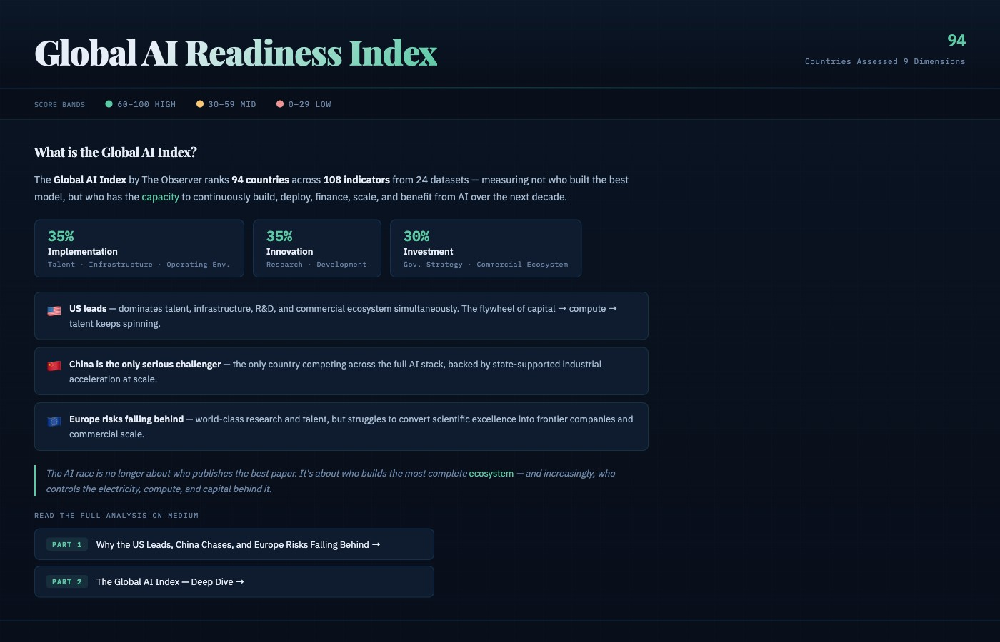
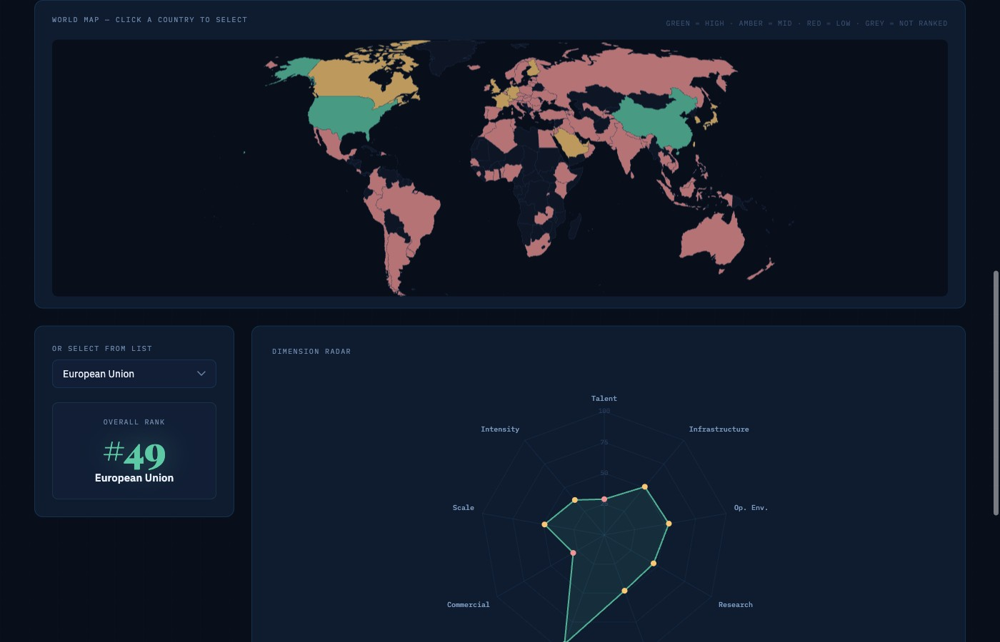
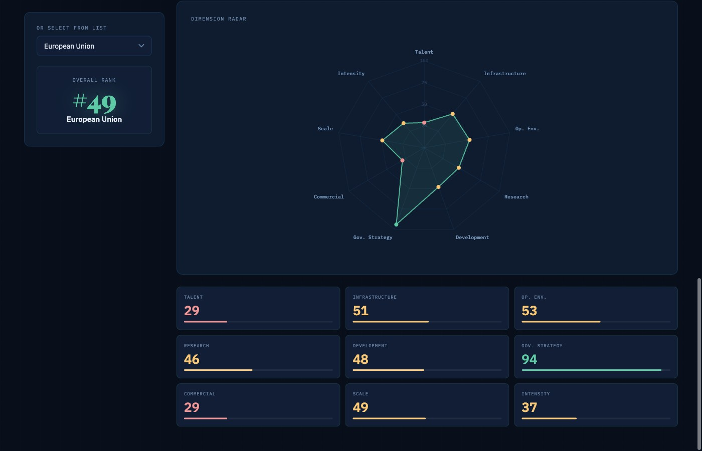
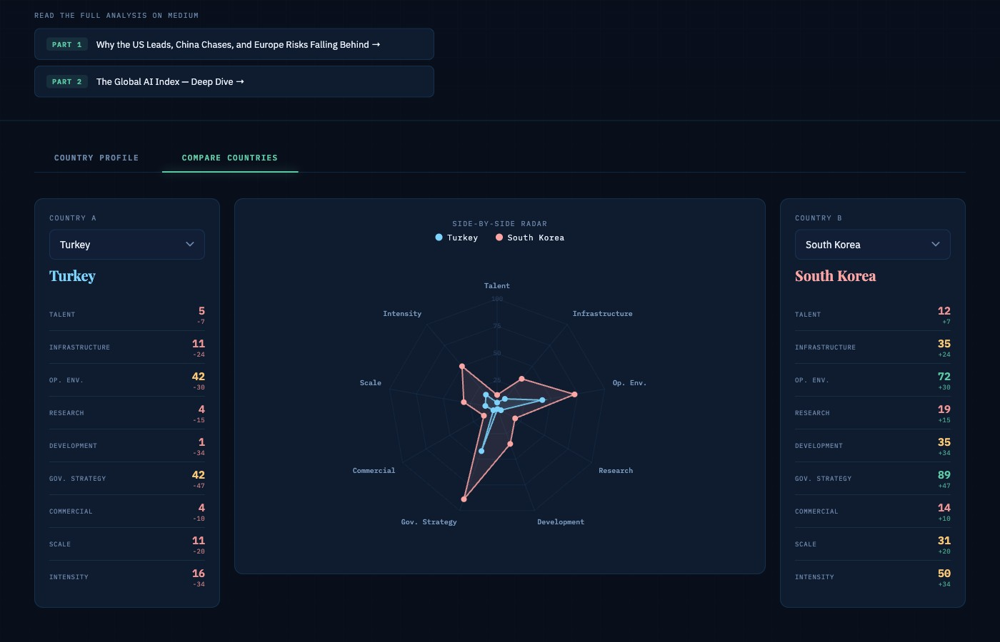

# Global AI Readiness Index

An interactive data visualization ranking **94 countries** across **9 dimensions** of AI readiness — built as a single self-contained HTML file.

> Based on the [Global AI Index by The Observer](https://observer.co.uk/data/global-ai), which tracks AI capacity (not just capability) using 108 indicators from 24 public and private datasets.

---

## What is the Global AI Index?

The index measures which countries have the **capacity to continuously build, deploy, finance, scale, and benefit from AI** — not just who built the latest model.

| Pillar | Weight | Dimensions |
|---|---|---|
| **Implementation** | 35% | Talent · Infrastructure · Operating Environment |
| **Innovation** | 35% | Research · Development |
| **Investment** | 30% | Government Strategy · Commercial Ecosystem |

**Key findings:**
- 🇺🇸 **US leads** — dominates talent, infrastructure, R&D, and commercial ecosystem simultaneously. The capital → compute → talent flywheel keeps spinning.
- 🇨🇳 **China is the only serious challenger** — competing across the full AI stack with state-supported industrial acceleration at scale.
- 🇪🇺 **Europe risks falling behind** — world-class research and talent, but struggles to convert scientific excellence into frontier companies and commercial scale.

> The AI race is no longer about who publishes the best paper. It's about who builds the most complete *ecosystem* — and increasingly, who controls the electricity, compute, and capital behind it.

📖 Read the full analysis on Medium:
- [Part 1 — Why the US Leads, China Chases, and Europe Risks Falling Behind](https://medium.com/@atabarezz/the-global-ai-index-1-a45f60e17470)
- [Part 2 — The Global AI Index: Deep Dive](https://medium.com/@atabarezz/the-global-ai-index-2-259d0c936fe1)

---

## Screenshots

### Overview & Summary


### Interactive World Map + Country Profile (European Union, #49)


### Dimension Scores — European Union


### Country Comparison — Turkey vs South Korea


---

## Features

- **Choropleth world map** — countries colored green/amber/red by average AI score. Click any country to instantly load its profile.
- **Country Profile tab** — radar/spider chart across all 9 dimensions + animated score cards with color-coded values and progress bars.
- **Compare Countries tab** — select two countries, see side-by-side data columns with +/− diff indicators and a dual-dataset overlapping radar chart.
- **Dropdown selector** — works in parallel with the map; both stay in sync.
- Hover tooltips on the map showing rank and score band.
- Pan and scroll-zoom on the map.

---

## Usage

Open `AI_Readiness_Index.html` directly in any modern browser — no server or build step required.

```bash
open AI_Readiness_Index.html
```

Or serve locally:

```bash
python3 -m http.server 8080
# then visit http://localhost:8080/AI_Readiness_Index.html
```

---

## Tech Stack

| Library | Purpose |
|---|---|
| [Chart.js 4](https://www.chartjs.org/) | Radar charts |
| [amCharts 5](https://www.amcharts.com/) | Interactive world map (Natural Earth projection) |
| [Google Fonts](https://fonts.google.com/) | Playfair Display · IBM Plex Mono · IBM Plex Sans |

No build tools. No frameworks. Single `.html` file.

---

## Data

All data sourced from the [Global AI Index by The Observer](https://observer.co.uk/data/global-ai). The 9 dimensions scored per country are:

`Talent` · `Infrastructure` · `Operating Environment` · `Research` · `Development` · `Government Strategy` · `Commercial` · `Scale` · `Intensity`

---

*Built by [Altan Atabarut](https://medium.com/@atabarezz)*
